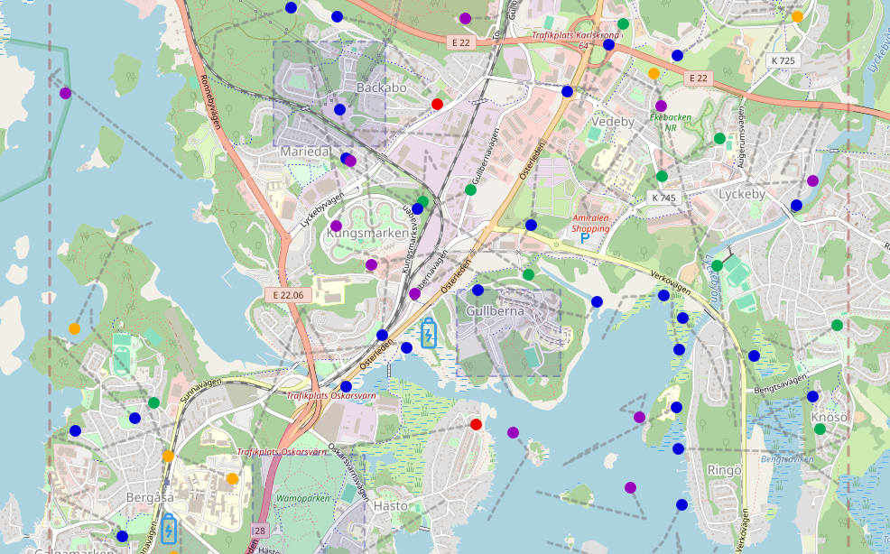

# Bike simulation app with backend API and database
This repository holds parts of the apps for the bike rental group assignment of the [Vteam course](https://dbwebb.se/kurser/vteam-v1) at BTH, Sweden.

The backend implements an API described in [public/index.html](backend/public/index.html), which is reachable at localhost:1337 or localhost:1337/api/v1/ for the running app.

An [SQLite3](https://www.sqlite.org/index.html) database is used for storage, with the library [better-sqlite3](https://github.com/WiseLibs/better-sqlite3) used for accessing data. Both the backend and the bike-sim apps are [Node.js](https://nodejs.org/en) applications.

## The simulation engine
The simulation app resides in [bike-sim/](bike-sim/). At startup, the database is cleared and filled with data described in [data/db_data.mjs](bike-sim/data/db_data.mjs). Some of the data is randomized, such as bike positions, battery level, and user names and account balance. Parts of the simulation are controlled by settings in [data/config.js](bike-sim/data/config.js), such as number of users and bikes in the simulation.

A few parameters controlling the simulation are currently hard-coded, e.g. the bike positions in each city are updated every 2100 ms, so that, with three cities, an update takes place once per 700 ms.

At startup, the number of bike rides is ramped up, with 10 % of the desired number of rides for each city update, so it takes some minute to reach the desired level.

After a configurable amount of time, rides are finished at a chance of 5 % for each city update. New rides are started to keep the desired number of rides.

An individual bike ride involves a user and a bike. The bike travels in a straight path in a random direction, and with a random constant speed. At city borders, the direction changes, so as to keep the bike inside the city, (cf. the Pong game).

At ride finish, the cost of the ride is computed, and the user's balance is withdrawn. There is a reduced fee if the ride starts outside a p-zone and finishes inside a p-zone, and there is an extra fee if the ride finishes outside a p-zone. A user's balance may go negative.

The execution time of a city update is measured and output to the console. For some hundred bikes in motion, the executions time is of the order of tens of milliseconds, so there seems to be room for even more bikes in the simulation.

## Visualization of the simulation
A visualization of the simulation was made using the mapping library [Leaflet](https://leafletjs.com/). For the running application it is available at localhost:1337/map.html. The JavaScript source file is [src/map.mjs](backend/public/src/map.mjs).

Bikes in a ride are shown as blue dots, and available bikes in green. For bikes low in battery (typically below 15 %), running bikes are violet and available bikes are yellowish. When the battery is completely discharged, the bike is shown in red and
stops, if it was in a ride with a user.

The city border is indicated by a dashed rectangle, as well as the parking zones, which also have a darker appearance. Charging stations are indicated by battery symbols.

The path traveled by an individual bike is shown as a gray dashed line. Where the paths make a sharp turn, a ride was finished and a new one started. Note that the bikes are confined within the city border.

If the simulation is left running, all bikes will eventually stop, as they are discharged. Below is a picture of a simulation, which has been running for a few minutes. The city is Karlskrona, Sweden.

## Starting the Docker containers holding the apps
The database is not stored in the repository, so to create the database and start the containers, one can run the shell script `./start_sim.bash`. For subsequent runs, once the database is in place, one could instead run just `docker compose up`.

The backend/db/ directory is mounted in the Docker containers, so that database changes are preserved between container restarts. However, in the simulation, the database is reset at startup.

The /bike-sim/data/ directory is also mounted, which contains simulation parameters in [config.js](bike-sim/data/config.js) and database content in [db_data.mjs](bike-sim/data/db_data.mjs).

## Stopping the containers
In a new terminal window, run `docker compose down`.

## Rebuilding
Run `docker compose build` if the source code or Dockerfile was changed after the first run.

