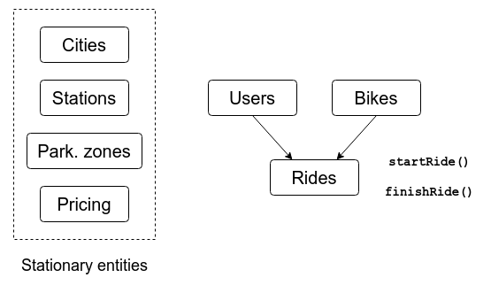

## Database entities

## Simulation
1. Generate stationary city data, a number of users and bikes  
   and put in database.
2. Loop through cities and call `updateCity(cityId)` every 700 ms.
3. In `updateCity()`:
   * Move all bikes in a ride.
   * Finish some rides with a certain probability (5 %).
   * Start new rides up to a certain amount:  
     Pair an available bike with an available user.